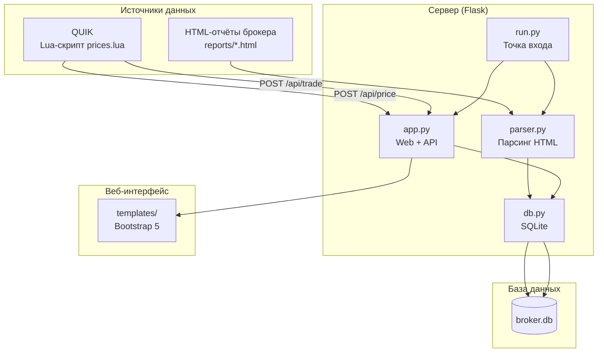

# Архитектура BrokerReport

## Общая схема



---

## Структура проекта

```
BrokerReport/
├── run.py                    # Точка входа: импорт отчётов + запуск Flask
├── requirements.txt          # Зависимости Python
├── ARCHITECTURE.md           # Этот файл
├── README.md                 # Документация
│
├── app/
│   ├── __init__.py           # Пакет приложения
│   ├── app.py                # Flask-приложение: роуты, API, фоновый дозор
│   ├── db.py                 # Модели SQLite + аналитические запросы
│   ├── parser.py             # Парсинг HTML-отчётов (BeautifulSoup + lxml)
│   ├── broker.db             # SQLite (создаётся автоматически)
│   └── templates/            # Bootstrap 5 шаблоны
│       ├── base.html         #   Базовый шаблон
│       ├── dashboard.html    #   Дашборд со сводной аналитикой
│       ├── index.html        #   Главная страница
│       └── report.html       #   Детальный просмотр отчёта
│
├── lua/
│   ├── prices.lua            # Скрипт для QUIK: отправка цен и сделок
│   └── trades.lua            # Скрипт для Kafka/AMQP (из другого проекта)
│   └── trade.proto           # Protobuf-схема (для trades.lua)
│
├── lua_modules/              # Локальные Lua-модули (LuaSocket, cjson и др.)
│   ├── lib/lua/5.3/          #   .dll (нативные модули)
│   └── share/lua/5.3/        #   .lua (скрипты)
│
├── reports/                  # HTML-отчёты брокера (входные данные)
│   └── *.HTML
│
└── copilot/
    └── instructions.md       # Инструкции для Copilot-агента
```

---

## Компоненты

### 1. `run.py` — точка входа

Запускает приложение:
1. Инициализирует БД (`init_db()`)
2. Автоматически импортирует все `.html`/`.HTML` файлы из папки `reports/`
3. Запускает фоновый дозор новых файлов (раз в 60 секунд)
4. Стартует Flask на `http://127.0.0.1:5000`

### 2. `app.py` — Flask-приложение

Содержит:
- **Веб-страницы:** `/` (дашборд), `/report/<id>` (детали отчёта)
- **API для цен:** `POST /api/price`, `GET /api/prices`
- **API для сделок QUIK:** `POST /api/trade`
- **API для инструментов:** `GET /api/instruments`
- **API для аналитики:** `GET /api/report/<id>/profit`, `/open`
- **Загрузка отчётов:** `POST /upload`
- **Фоновый дозор:** `_watch_folder()` — поток-demon проверяет новые HTML-файлы

### 3. `parser.py` — парсинг HTML

Разбирает HTML-отчёт брокера с помощью BeautifulSoup + lxml. Извлекает:
- Метаданные: номер договора, инвестор, период
- Сделки купли/продажи (`trade`)
- Сделки РЕПО (`repo`)
- Движение денежных средств (`cash_flow`)
- Портфель ценных бумаг (`portfolio`)
- Финансовый результат (`financial_result`)

### 4. `db.py` — база данных и аналитика

SQLite с функциями:
- `init_db()` — создание таблиц и миграции
- LIFO-матчинг сделок (`_match_trades_lifo()`) для расчёта прибыли
- Аналитические запросы: прибыль по инструментам, открытые позиции, расходы на РЕПО
- Upsert текущих цен (`current_price`)
- Сохранение сделок из QUIK (`quik_trade`) с дедупликацией

### 5. `lua/prices.lua` — скрипт для QUIK

Работает в терминале QUIK:
- Подписывается на `OnAllTrade` (обезличенные сделки)
- Фильтрует только инструменты пользователя (загружаются с `GET /api/instruments`)
- Раз в 1 сек отправляет пачку цен на `POST /api/price`
- Раз в 3 сек отправляет пачку сделок на `POST /api/trade`
- Локальные модули из `lua_modules/` (без внешних зависимостей)

---

## База данных SQLite

### Схема таблиц

#### `report` — метаданные отчёта
| Колонка | Тип | Описание |
|---------|-----|----------|
| id | INTEGER PK | Автоинкремент |
| filename | TEXT UNIQUE | Имя файла отчёта |
| contract | TEXT | Номер договора |
| investor | TEXT | Инвестор |
| period_start | TEXT | Начало периода (DD.MM.YYYY) |
| period_end | TEXT | Конец периода (DD.MM.YYYY) |
| created_at | TEXT | Дата импорта |

#### `trade` — сделки купли/продажи (из отчётов и QUIK)
| Колонка | Тип | Описание |
|---------|-----|----------|
| id | INTEGER PK | Автоинкремент |
| report_id | INTEGER FK → report(id) | Ссылка на отчёт |
| trade_date | TEXT | Дата сделки (DD.MM.YYYY) |
| settle_date | TEXT | Дата расчётов |
| trade_time | TEXT | Время сделки |
| security_name | TEXT | Наименование бумаги |
| security_code | TEXT | Код бумаги (SBER, MOEX…) |
| currency | TEXT | Валюта (RUB) |
| side | TEXT | Покупка / Продажа |
| quantity | INTEGER | Количество |
| price | REAL | Цена |
| amount | REAL | Сумма |
| nkd | REAL | НКД |
| broker_fee | REAL | Комиссия брокера |
| exchange_fee | REAL | Комиссия биржи |
| deal_number | TEXT | Номер сделки |
| comment | TEXT | Комментарий |
| status | TEXT | Статус |
| **source** | TEXT | `'report'` (из отчёта) / `'quik'` (из QUIK) |

Уникальный индекс: `(source, deal_number)` где `deal_number` не NULL.

#### `repo` — сделки РЕПО
| Колонка | Тип | Описание |
|---------|-----|----------|
| id | INTEGER PK | Автоинкремент |
| report_id | INTEGER FK | Ссылка на отчёт |
| trade_date | TEXT | Дата сделки |
| trade_time | TEXT | Время |
| security_name | TEXT | Наименование |
| security_code | TEXT | Код бумаги |
| side | TEXT | Сторона |
| quantity | INTEGER | Количество |
| price_part1 / nkd_part1 / amount_part1 / date_part1 | | Первая часть РЕПО |
| repo_rate | REAL | Ставка РЕПО |
| repo_interest | REAL | Проценты по РЕПО |
| price_part2 / nkd_part2 / amount_part2 / date_part2 | | Вторая часть РЕПО |
| broker_fee / exchange_fee | REAL | Комиссии |
| deal_number | TEXT | Номер сделки |
| **source** | TEXT | `'report'` / `'quik'` |

Уникальный индекс: `(source, deal_number)` где `deal_number` не NULL.

#### `cash_flow` — движение денежных средств
| Колонка | Тип | Описание |
|---------|-----|----------|
| id | INTEGER PK | Автоинкремент |
| report_id | INTEGER FK | Ссылка на отчёт |
| date | TEXT | Дата операции |
| description | TEXT | Описание |
| currency | TEXT | Валюта |
| credit | REAL | Поступление |
| debit | REAL | Списание |

#### `portfolio` — портфель ценных бумаг
| Колонка | Тип | Описание |
|---------|-----|----------|
| id | INTEGER PK | Автоинкремент |
| report_id | INTEGER FK | Ссылка на отчёт |
| security_name | TEXT | Наименование |
| isin | TEXT | ISIN |
| currency | TEXT | Валюта |
| qty_start / qty_end | INTEGER | Остаток на начало/конец |
| price_start / price_end | REAL | Цена на начало/конец |
| value_start / value_end | REAL | Стоимость на начало/конец |
| qty_change | INTEGER | Изменение количества |
| value_change | REAL | Изменение стоимости |

#### `financial_result` — финансовый результат (налоговый раздел)
| Колонка | Тип | Описание |
|---------|-----|----------|
| id | INTEGER PK | Автоинкремент |
| report_id | INTEGER FK UNIQUE | Ссылка на отчёт |
| income_code | TEXT | Код дохода |
| income_amount | REAL | Сумма дохода |
| expense_code | TEXT | Код расхода |
| expense_amount | REAL | Сумма расхода |
| taxable_amount | REAL | Налогооблагаемая база |
| tax_rate | REAL | Ставка налога |
| tax_calculated | REAL | Налог исчисленный |
| tax_withheld | REAL | Налог удержанный |
| tax_due | REAL | Налог к доплате |

#### `current_price` — текущие цены инструментов
| Колонка | Тип | Описание |
|---------|-----|----------|
| id | INTEGER PK | Автоинкремент |
| sec_code | TEXT | Код бумаги (SBER, GAZP…) |
| class_code | TEXT | Код класса (TQBR…) |
| price | REAL | Текущая цена |
| qty | INTEGER | Объём последней сделки |
| value | REAL | Сумма последней сделки |
| timestamp | TEXT | Время обновления |

Уникальный индекс: `(sec_code, class_code)` — хранится только последняя цена (upsert).

#### `quik_trade` — сырые сделки из QUIK (OnAllTrade)
| Колонка | Тип | Описание |
|---------|-----|----------|
| id | INTEGER PK | Автоинкремент |
| trade_num | INTEGER | Номер сделки в QUIK |
| sec_code | TEXT | Код бумаги |
| class_code | TEXT | Код класса |
| price | REAL | Цена |
| qty | INTEGER | Количество |
| value | REAL | Сумма |
| accruedint | REAL | НКД |
| yield | REAL | Доходность |
| settlecode | TEXT | Код расчётов |
| reporate / repovalue / repo2value / repoterm | | Параметры РЕПО (если применимо) |
| period | INTEGER | Период |
| trade_date | TEXT | Дата сделки |
| trade_time | TEXT | Время сделки |
| source | TEXT | `'quik'` |
| created_at | TEXT | Время сохранения |

Уникальный индекс: `(source, trade_num)` — дедупликация по номеру сделки.

---

## API Endpoints

| Метод | Путь | Описание | Формат запроса |
|-------|------|----------|---------------|
| GET | `/` | Дашборд со сводной аналитикой | Query: `?date_from=&date_to=` |
| GET | `/report/<id>` | Детальный просмотр отчёта | — |
| POST | `/upload` | Загрузка HTML-отчёта | `multipart/form-data` или `filepath` |
| **POST** | **`/api/price`** | **Принять цену инструмента** | `{"sec_code":"SBER","price":250}` или `{"prices":[...]}` |
| **GET** | **`/api/prices`** | **Получить все текущие цены** | — |
| **POST** | **`/api/trade`** | **Принять сделки из QUIK** | `{"trades":[...]}` |
| **GET** | **`/api/instruments`** | **Список инструментов пользователя** | — |
| GET | `/api/report/<id>/profit` | Прибыль по сделкам отчёта | — |
| GET | `/api/report/<id>/open` | Открытые позиции отчёта | — |

---

## Потоки данных

### Поток 1: Импорт отчёта
```
HTML-файл → parser.parse_report() → SQLite (trade, repo, cash_flow, portfolio, financial_result)
                                          ↓
                                   LIFO-матчинг → аналитика на дашборде
```

### Поток 2: Цены из QUIK
```
QUIK OnAllTrade → prices.lua (кеш) → POST /api/price → SQLite current_price (upsert)
                                                              ↓
                                                       GET /api/prices
```

### Поток 3: Сделки из QUIK
```
QUIK OnAllTrade → prices.lua (очередь) → POST /api/trade → SQLite quik_trade (INSERT OR IGNORE)
                                                                  ↓
                                                           current_price (upsert)
```

---

## Расчёт прибыли (LIFO)

Используется **LIFO** (Last In, First Out):
- Все сделки обрабатываются в хронологическом порядке
- Покупки добавляются в очередь
- Каждая продажа матчится с **последней** покупкой в очереди (самая свежая)
- Непарные покупки = открытые позиции

---

## Дедупликация

| Сценарий | Механизм |
|----------|----------|
| Один и тот же отчёт перепарсен | DELETE by report_id → INSERT |
| Одна сделка в нескольких отчётах | `INSERT OR IGNORE` + уникальный индекс `(source, deal_number)` |
| Дубликат сделки из QUIK | `INSERT OR IGNORE` + уникальный индекс `(source, trade_num)` |
