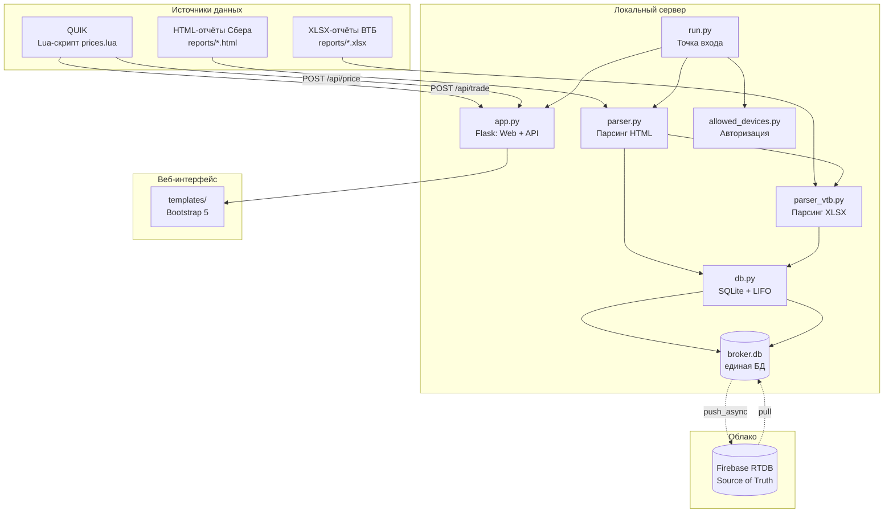

# Архитектура BrokerReport

## Общая схема


```mermaid
flowchart TB
    subgraph "Источники данных"
        A[HTML-отчёты Сбера<br/>reports/*.html]
        A2[XLSX-отчёты ВТБ<br/>reports/*.xlsx]
        B[QUIK<br/>Lua-скрипт prices.lua]
    end

    subgraph "Локальный сервер"
        C[run.py<br/>Точка входа]
        D[app.py<br/>Flask: Web + API]
        E[parser.py<br/>Парсинг HTML]
        E2[parser_vtb.py<br/>Парсинг XLSX]
        F[db.py<br/>SQLite + LIFO]
        G[(broker.db<br/>единая БД)]
        Auth[allowed_devices.py<br/>Авторизация]
    end

    subgraph "Облако"
        FB[(Firebase RTDB<br/>Source of Truth)]
    end

    subgraph "Веб-интерфейс"
        H[templates/<br/>Bootstrap 5]
    end

    A --> E --> F --> G
    A2 --> E2 --> F --> G
    B -->|POST /api/trade| D
    B -->|POST /api/price| D
    C --> D --> H
    C --> E --> E2
    C --> Auth

    G -.->|push_async| FB
    FB -.->|pull| G
```

---

## Ключевые принципы

### Единая таблица сделок

Все сделки, независимо от источника, хранятся в **одной таблице `trade`**:

| source | Происхождение |
|--------|--------------|
| `'sber'` | Из HTML-отчёта Сбера |
| `'vtb'` | Из XLSX-отчёта ВТБ |
| `'quik'` | Из QUIK OnTrade/OnAllTrade |

QUIK-трейды больше **не хранятся отдельно** в `quik_trade`. Таблица `quik_trade` сохранена для обратной совместимости, но:
- Запись: `save_quik_trades()` пишет сразу в `trade` (source='quik') + дублирует в `quik_trade`
- Чтение: все аналитические функции читают только из `trade`
- LIFO: `_match_trades_lifo()` не использует `_fetch_quik_trades()`

### Firebase = Source of Truth

Firebase RTDB — единое облачное хранилище, куда стекаются данные со всех хостов.

**Процесс синхронизации:**
1. **Pull** (синхронно при старте): загружает последнюю версию из Firebase → локальный SQLite
2. **Push** (асинхронно, не блокирует): отправляет локальные данные в Firebase
3. **Фоновый sync** (daemon-поток): периодически pull + push

**Ключи в Firebase для `trade`:**
- `trade/{source}_{deal_number}` — единый формат для всех источников (с 28.07.2026)
- Раньше: `trade/{deal_number}` — приводило к дубликатам при pull из-за S/B-префиксов у одинаковых сделок из разных источников

**Таблица `nalog` в Firebase:**
- Добавлена 28.07.2026
- Ключ: `nalog/{year}_{deal_number}`
- Содержит данные из налоговых отчётов ВТБ (парсер `parser_nalog.py`)
- Позволяет сверить брокерские сделки (`trade`) с налоговыми (`nalog`) по deal_number

**Дедупликация при pull (`_pull_table`):**
- Для `trade` перед вставкой проверяется `(source, deal_number)` — если уже есть, запись пропускается
- Push для `trade` использует `set()` вместо `update()` — полностью перезаписывает узел, удаляя старые ключи

### Асинхронный push

`push_async()` запускает отправку в Firebase в **фоновом daemon-потоке**. Старт приложения не блокируется:
- После `init_replication()` → pull (sync) + push_async
- После импорта отчётов → push_async
- Фоновый sync работает в своём потоке

---

## Структура проекта

```
BrokerReport/
├── run.py                    # Точка входа
├── requirements.txt          # Зависимости
├── ARCHITECTURE.md           # Этот файл
├── README.md                 # Документация
├── Dockerfile                # Образ для Docker
├── docker-compose.yml        # Docker-сервис
│
├── app/
│   ├── __init__.py
│   ├── app.py                # Flask: роуты, API, авторизация
│   ├── db.py                 # SQLite: модели, LIFO, аналитика
│   ├── parser.py             # Парсинг HTML (Сбер)
│   ├── parser_vtb.py         # Парсинг XLSX (ВТБ)
│   ├── parser_mytrades.py    # Парсинг my_trades.xlsx
│   ├── parser_nalog.py       # Парсинг налоговых отчётов
│   ├── parser_openbroker.py  # Парсинг OpenBroker
│   ├── replication.py        # Firebase sync (push_async)
│   ├── firebase_config.py    # Настройки Firebase
│   ├── allowed_devices.py    # Авторизация устройств
│   ├── broker.db             # SQLite (создаётся автоматически)
│   └── templates/            # Bootstrap 5 шаблоны
│       ├── base.html
│       ├── dashboard.html    # Дашборд со сводной аналитикой
│       ├── report.html       # Детальный просмотр отчёта
│       └── ...
│
├── reports/                  # HTML/XLSX-отчёты (входные данные)
├── lua/prices.lua            # Lua-скрипт для QUIK
├── logs/                     # Логи
│
└── copilot/
    └── instructions.md       # Инструкции для Copilot-агента
```

---

## Компоненты

### 1. `run.py` — точка входа

```python
init_db()                    # Создание таблиц + миграции
init_replication()           # pull (sync) + push_async
_auto_import()               # Импорт новых отчётов → push_async
start_watcher()              # Фоновый дозор новых файлов
flask_app.run()              # Старт Flask
```

### 2. `app.py` — Flask-приложение

Роуты:
- `GET /` — дашборд с LIFO-аналитикой (фильтр: даты, брокер)
- `GET /report/<id>` — детали отчёта
- `POST /upload` — загрузка отчёта
- `POST /api/trade` — приём сделок из QUIK → `save_quik_trades()`
- `POST /api/price` — приём цен из QUIK
- `GET /api/prices` — текущие цены
- `GET /api/instruments` — инструменты пользователя

### 3. `db.py` — база данных и LIFO

Ключевые функции:
- `init_db()` — создание таблиц и миграции (в т.ч. quik_trade → trade)
- `save_quik_trades()` — запись QUIK-трейдов в `trade` + `quik_trade` + push_async
- `_match_trades_lifo()` — **LIFO-матчинг** (ядро расчёта прибыли)
- `get_trade_profit()` — агрегация прибыли по инструментам
- `get_trades_list()` — список сделок с пагинацией (из одной таблицы `trade`)
- `get_open_trades()` — открытые позиции (несматченные покупки)
- `get_repo_total()` — расходы на РЕПО

### 4. `replication.py` — Firebase sync

- `push()` — полная выгрузка всех таблиц в Firebase
- `push_async()` — то же в фоновом потоке (не блокирует)
- `pull()` — загрузка из Firebase → локальный SQLite (INSERT OR IGNORE)
- `init_replication()` — pull + push_async + старт фонового sync
- `start_background_sync()` — daemon-поток с периодическим pull+push

### 5. `lua/prices.lua` — скрипт для QUIK

- Подписка на `OnAllTrade` и `OnTrade`
- Фильтрация инструментов пользователя (GET /api/instruments)
- Отправка цен на `POST /api/price` (раз в 1 сек)
- Отправка сделок на `POST /api/trade` (раз в 3 сек)
- Определение стороны сделки через флаги QUIK (OnTrade: operation_type; OnAllTrade: flags)

---

## База данных SQLite

### Таблица `trade` — единая для всех сделок

| Колонка | Тип | Описание |
|---------|-----|----------|
| id | INTEGER PK | Автоинкремент |
| report_id | INTEGER FK | Ссылка на отчёт (для source='quik' — псевдо-отчёт `_quik_ontrade_`) |
| trade_date | TEXT | Дата сделки (DD.MM.YYYY) |
| settle_date | TEXT | Дата расчётов |
| trade_time | TEXT | Время сделки |
| security_name | TEXT | Наименование бумаги |
| security_code | TEXT | Код бумаги (SBER, MTSS, RAGR…) |
| class_code | TEXT | Код класса (TQBR, TQOB…) |
| currency | TEXT | Валюта (RUB) |
| side | TEXT | Покупка / Продажа |
| quantity | INTEGER | Количество |
| price | REAL | Цена |
| amount | REAL | Сумма |
| nkd | REAL | НКД |
| broker_fee | REAL | Комиссия брокера |
| exchange_fee | REAL | Комиссия биржи |
| deal_number | TEXT | Номер сделки (уникален в рамках биржи) |
| comment | TEXT | Комментарий / venue |
| status | TEXT | Статус |
| **source** | TEXT | `'sber'` / `'vtb'` / `'quik'` |
| **broker** | TEXT | Брокер для QUIK-трейдов (`'sber'` / `'vtb'` / `''`) |
| **account** | TEXT | Номер счёта (из QUIK OnTrade) |
| **flags** | INTEGER | Флаги QUIK (OnAllTrade) |
| **operation** | TEXT | Операция QUIK ('B'/'S') |
| **operation_type** | INTEGER | Тип операции QUIK (0=buy, 1=sell) |

Уникальные индексы:
- `(source, deal_number)` — для source='sber'/'vtb'
- `(source, deal_number) WHERE source='quik'` — для QUIK

### Остальные таблицы

`report`, `repo`, `cash_flow`, `portfolio`, `financial_result`, `current_price`, `instrument` — без изменений.  
`quik_trade` — сохранена для обратной совместимости, но не используется в расчётах.

---

## LIFO-матчинг

### Алгоритм (`_run_lifo()`)

```
Вход: список сделок, отсортированных по дате

Для каждой сделки:
  Если Покупка → добавить в конец buy_queue [qty, цена, исходные_данные, комиссия]
  Если Продажа:
    Пока остаток > 0 и очередь не пуста:
      Взять ПОСЛЕДНИЙ лот из buy_queue (LIFO)
      Использовать min(доступно, остаток)
      Расчёт: profit = сумма_продажи - сумма_покупки
      Комиссии: пропорционально used/total
      Записать lot {buy_date, sell_date, qty, profit, fees}
    Если остаток > 0 → FIFO-свип (матчинг оставшихся)
```

### Распределение по источникам (`_match_trades_lifo()`)

| Режим (broker) | Какие source'ы матчатся вместе |
|----------------|-------------------------------|
| `'sber'` | `source='sber'` + `source='quik' AND broker='sber'` |
| `'vtb'` | `source='vtb'` + `source='quik' AND broker='vtb'` |
| `'all'` | Каждый источник отдельно: sber+QUIK(sber), vtb+QUIK(vtb), QUIK(без broker) |

### Дедупликация в LIFO

При матчинге всех источников используется общий `seen_deals_all` (множество `(sec_code, deal_number)`). Если сделка уже встречена (например, из source='sber'), её QUIK-дубль с тем же номером игнорируется. Первый встреченный выигрывает.

---

## Потоки данных

### Импорт отчёта
```
HTML/XLSX → parse_report() → SQLite trade(source='sber'/'vtb') → push_async() → Firebase
```

### Сделки из QUIK
```
QUIK → Lua → POST /api/trade → save_quik_trades() → SQLite trade(source='quik')
                                                        ↓
                                                  push_async() → Firebase
                                                        ↓
                                             (дубль в quik_trade для совместимости)
```

### Запрос дашборда
```
GET / → get_trade_profit() → _match_trades_lifo() → SQLite trade
       ↓
  LIFO-матчинг → рендер dashboard.html
```

### Синхронизация хостов
```
Хост A (Сбер) ──push──→ Firebase ──pull──→ Хост B (ВТБ)
                                    ──pull──→ Хост C (только дашборд)
```

---

## API Endpoints

| Метод | Путь | Описание |
|-------|------|----------|
| GET | `/` | Дашборд: LIFO P&L, РЕПО, открытые позиции |
| GET | `/report/<id>` | Детальный просмотр отчёта |
| POST | `/upload` | Загрузка HTML/XLSX-отчёта |
| POST | `/api/trade` | Принять сделки из QUIK |
| POST | `/api/price` | Принять цену инструмента |
| GET | `/api/prices` | Текущие цены |
| GET | `/api/instruments` | Инструменты пользователя |
| GET | `/api/quik-trades` | Последние QUIK-трейды (из trade) |
| GET | `/api/quik-connected` | Статус подключения QUIK |
| GET | `/api/accounts` | Список счетов QUIK для настройки |

---

## Firebase-синхронизация

### Структура Firebase

```
broker_db/
  trade/
    {deal_number}: {...}           # source='sber'/'vtb'
    quik_{deal_number}: {...}      # source='quik'
  report/
    {filename}: {...}
  repo/
    {source}_{deal_number}: {...}
  quik_trade/
    {source}_{trade_num}: {...}
  current_price/
    {sec_code}_{class_code}: {...}
  _meta/
    hostname: PC-1
    updated: ISO-8601
```

### Ключи для `trade` в Firebase

- **Из отчётов** (source='sber'/'vtb'): ключ = `deal_number` (номер сделки уникален в рамках биржи)
- **Из QUIK** (source='quik'): ключ = `quik_{deal_number}` — чтобы не перетереть данные из отчёта (где есть комиссии)

### Правила синхронизации

- **Push**: `update()` — добавляет/обновляет записи, не удаляет данные других хостов
- **Pull**: `INSERT OR IGNORE` — новые данные добавляются, существующие не перезаписываются
- **Pull при старте**: только если облачная версия новее локальной (по `_meta.updated`)
- **Push после импорта**: асинхронный (push_async), не блокирует старт

---

## Docker

### Образ (Dockerfile)
- Базовый образ: `python:3.11-slim`
- Устанавливаются зависимости из `requirements.txt`
- Точка входа: `python run.py`

### Docker Compose
```yaml
services:
  broker-report:
    build: .
    ports: ["5000:5000"]
    volumes:
      - ./reports:/app/reports    # HTML-отчёты на хосте
      - db_data:/app/app          # SQLite в Docker volume
      - ./logs:/app/logs
    environment:
      - FLASK_HOST=0.0.0.0
      - FLASK_PORT=5000
```
]
```

### Middleware (`app.py`)

- `before_request` проверяет `X-Device-ID` (заголовок, cookie или query-параметр)
- `/admin*` — требует админ-токен, проверяется внутри обработчика
- `/api/device-register` — доступен без device_id (регистрация новых устройств)
- Статика — пропускается без проверки
- Неавторизованные запросы → 401 (API) или страница `device_auth.html` (web)

### Поток авторизации

1. Пользователь открывает сайт → middleware не находит device_id → `device_auth.html`
2. Браузер генерирует уникальный device_id (localStorage + cookie)
3. Пользователь сообщает device_id администратору
4. Администратор заходит в `/admin`, вводит админ-токен, добавляет устройство
5. Пользователь нажимает "Проверить доступ" → перезагрузка → доступ разрешён

### API управления устройствами

| Метод | Путь | Описание |
|-------|------|----------|
| GET | `/admin` | Веб-панель управления устройствами |
| POST | `/api/device-register` | Регистрация нового устройства (JSON: `device_id`, `label`, `admin_token`) |
| GET | `/api/admin/devices` | Список всех устройств (требует `X-Admin-Token`) |

### Режимы работы

| Переменная | Значение | Режим |
|-----------|----------|-------|
| `DISABLE_DEVICE_AUTH` (env) | `true` | Локальная разработка — авторизация ОТКЛЮЧЕНА |
| `DISABLE_DEVICE_AUTH` (env) | не задана / `false` | Docker/prod — авторизация ВКЛЮЧЕНА |
| `ADMIN_TOKEN` (env) | любая строка | Мастер-токен для панели `/admin` |
